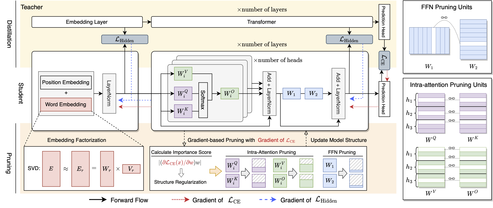

# GRAIN

This is the repo of paper *Gradient-based Intra-attention Pruning on Pre-trained Language Models* accepted to ACL 2023.

The repo is under construction.


<p align="center">The workflow of GRAIN
</p>

## Usage

### Step 1: Preparation

1. Prepare the teacher models. We provide the teacher models of GLUE (MNLI, QNLI, QQP and SST2) and SQuAD tasks, which can be downloaded on [Google Drive](https://drive.google.com/file/d/1gLrdtwS4xfakvWo5-2_BTP3mPB55hohv/view?usp=sharing). Unzip the `teacher_models.zip`, The content of `teacher_models` should be
```
teacher_models\
    mnli\
      pytorch_model.bin
    qnli\
      pytorch_model.bin
    qqp\
      pytorch_model.bin
    sst2\
      pytorch_model.bin
    squad\
      pytorch_model.bin
    config.json
    vocab.txt
```

2. Prepare the GLUE and SQuAD datasets. Put the datasets to `datasets`.

  
### Step 2: Training/Distillation with Pruning

We offer examples of training on GLUE and SQuAD. 

**GLUE**

```
cd scripts
bash run_glue.sh
```
 Change the `TASK` to one of `sst2|mnli|qnli|qqp` to run different tasks.


**SQuAD**

```
cd scripts
bash run_squad.sh
```

### Post Pruning


The model obtained in the above step are store with full parameters and pruning masks. We then then perform post-pruning operation to remove the weights from the model.

Run the `PostPruning.ipynb` and follow the steps there to remove the redundant weights and test the inference speed of the pruned model.